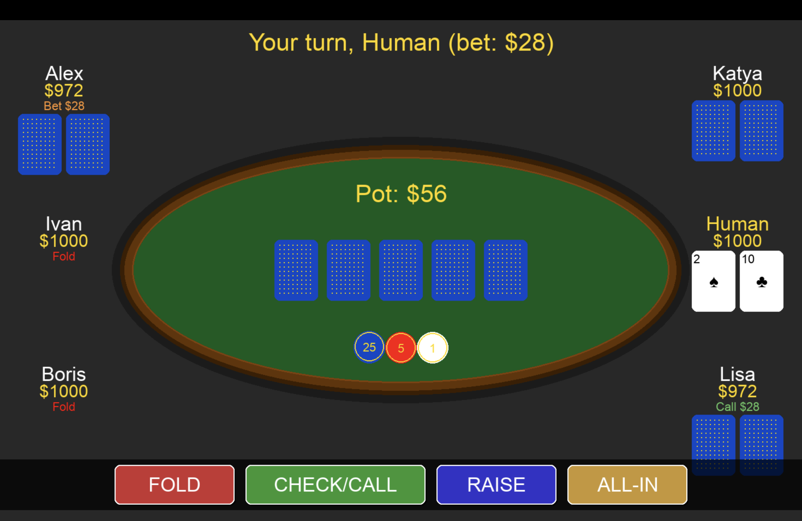
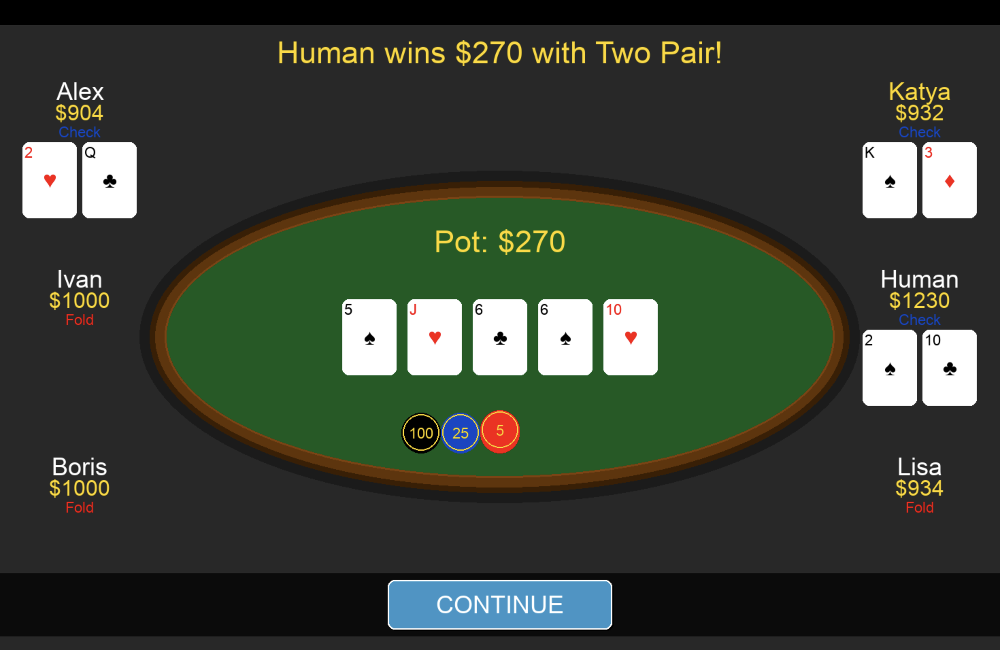

# Texas Hold'em Poker

Игра в покер Texas Hold'em с графическим интерфейсом на Python и Pygame.

## Описание

Полнофункциональная игра в покер против 5 AI-противников с:
- Реалистичным овальным покерным столом
- Правильной оценкой покерных комбинаций (включая кикеры)
- Системой ставок с возможностью Fold, Check, Call, Raise и All-In
- Отображением последних действий игроков
- Showdown с показом выигрышной комбинации

## Скриншоты

### Игровой процесс

*Основной экран игры с покерным столом*

### Диалог повышения ставки

*Окно для выбора суммы raise*

### Showdown

*Показ выигрышной комбинации*

## Требования

- Python 3.7+
- Pygame

## Установка

1. Клонируйте репозиторий или скачайте файлы
2. Создайте виртуальное окружение (опционально):
```bash
python3 -m venv .venv
source .venv/bin/activate  # macOS/Linux
```

3. Установите зависимости:
```bash
pip install pygame
```

## Запуск

```bash
python3 poker_game.py
```

## Правила игры

### Базовые правила Texas Hold'em
1. Каждый игрок получает 2 закрытые карты
2. На стол выкладываются 5 общих карт в три этапа:
   - **Flop** - 3 карты
   - **Turn** - 4-я карта
   - **River** - 5-я карта
3. После каждого этапа проходит раунд ставок
4. Выигрывает игрок с лучшей комбинацией из 5 карт (2 свои + 3 из общих)

### Покерные комбинации (от старшей к младшей)
1. **Straight Flush** - 5 карт одной масти по порядку
2. **Four of a Kind** - 4 карты одного ранга
3. **Full House** - 3 карты одного ранга + 2 карты другого ранга
4. **Flush** - 5 карт одной масти
5. **Straight** - 5 карт по порядку
6. **Three of a Kind** - 3 карты одного ранга
7. **Two Pair** - 2 пары
8. **Pair** - пара
9. **High Card** - старшая карта

### Действия в игре
- **Fold** - сбросить карты и выйти из раунда
- **Check** - пропустить ход (доступно, если нет активной ставки)
- **Call** - уравнять текущую ставку
- **Raise** - повысить ставку
- **All-In** - поставить все оставшиеся фишки

## Начальные условия

- Каждый игрок начинает с **$1000**
- Игра продолжается пока у вас остаются деньги
- После проигрыша всех денег игра завершается

## Структура проекта

- `poker_game.py` - основной файл с логикой игры
- `poker_gui.py` - графический интерфейс (текущая версия)
- `poker_gui_old.py` - старая версия GUI (для сравнения)
- `Poker_main.py` - консольная версия игры (legacy)
- `textpoker.cpp` - C++ версия (legacy)

## Особенности реализации

### Оценка комбинаций
Игра использует систему на основе tuple для правильного сравнения рук:
- Сравниваются не только типы комбинаций, но и кикеры
- Учитываются все 5 карт при одинаковых комбинациях
- Поддержка специального случая A-2-3-4-5 (wheel straight)

### AI
- Простая эвристика на основе силы карт
- AI принимает решения в зависимости от:
  - Старшей карты на руках
  - Наличия пары
  - Текущей ставки
